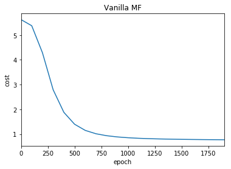
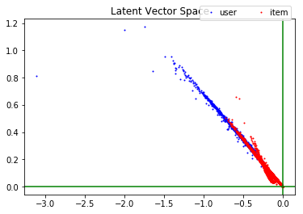
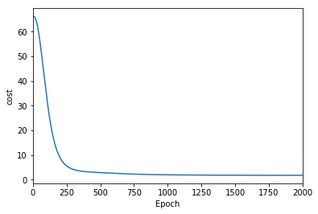
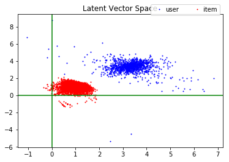
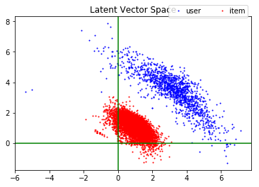
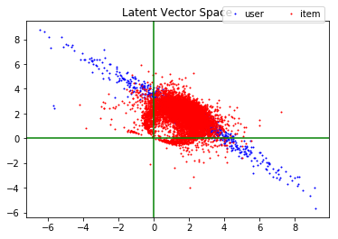
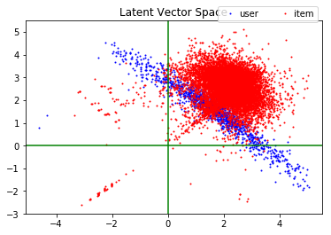

### Matrix factorization techniques for recommender systems
---

### Dataset
I took dataset from [here](https://github.com/caserec/Datasets-for-Recommneder-Systems/tree/master/Processed%20Datasets/BookCrossing).  
Please, refer to above link if you want description.

Data는 [이 곳](https://github.com/caserec/Datasets-for-Recommneder-Systems/tree/master/Processed%20Datasets/BookCrossing)에서 가져왔다.  
Data에 대한 설명은 위 링크를 참고하길 바란다.  

---

### Experimental Environment
- colab(GPU)
- numpy
- pandas
- tensorflow
- matplotlib
---

### Description
I refer to [this paper](https://dl.acm.org/citation.cfm?id=1608614).  
I implemented this paper with numpy and keras.  
It is executed to numpy or keras according to CPU or GPU.  
Seed is fixed for achieving reproducible model.  
These two models have difference for the number of trainable parameter.  
For example, suppose latent dimension is 2.  
In the numpy model if the number of user and item is 100 and 1000, then the number of trainable parameter is 100 * 2 + 1000 * 2.   
But, in the keras model if user, item`s ID max is 250 and 1300 despite the number of user and item, then it is 250 * 2 + 1300 * 2.  
Scatter plot for latent vectors is drawn when latent dimension is only 2.  

[이 논문](https://dl.acm.org/citation.cfm?id=1608614)을 참고했다.  
numpy와 keras로 구현했다.  
실행 환경(CPU or GPU)에 따라 numpy 혹은 keras model로 실행된다.  
reproducible model을 얻기 위해 seed를 고정했다.  
numpy model과 keras model의 trainable parameter 수의 차이가 있다.  
numpy model은 데이터 안에 유저와 아이템 수에 대해 latent vector를 생성한다.  
keras model은 데이터 안에 유저와 아이템 ID에 대해 latent vector를 생성한다.  
예를 들어 numpy model에서 유저와 아이템의 수가 각각 100, 1000이라면 trainable parameter 수는 100 * latent_dimension + 1000 * latent_dimension이다.  
keras model에서는 유저와 아이템의 수가 각각 100, 1000이지만 유저와 아이템 ID의 최대값이 250, 1300이라면 trainiable parameter 수는 250 * latent_dimension + 1300 * latent_dimension이다.  
latent dimension이 2일 때, latent vector에 대한 scatter plot을 그린다.  

---

### How to Use
ㅁㄴㅇ

---

### Experimental Result

##### Training and Evaluation
Numpy model takes adverse influence by data`s original scale.  
So, in this model it is converted to range 0 ~ 1.  
Keras model takes adverse influence by scale down.  
So, in this model original scale is used.  
Dataset is not split to training and test.  
All data is used to train the model.  
So, model evaluation is substituted to last cost.  
The cost is defined to [RMSE](https://en.wikipedia.org/wiki/Root-mean-square_deviation).  

numpy model은 원래 scale을 사용하면 학습이 잘 안되어 0 ~ 1로 줄였다.  
반면, keras model은 0 ~ 1로 줄이면 학습이 잘 안되어 원래 scale을 사용했다.  
데이터를 모두 학습에 사용했다.  
model evaluation은 마지막 [RMSE](https://en.wikipedia.org/wiki/Root-mean-square_deviation)를 사용했다.  

##### Comparison and Result
###### numpy model
cost plot L2 rate 1e-1|L2 rate 1e+1|L2 rate 1e-1|L2 rate 0|
:--:|:--:|:--:|:--:|
||||

###### keras model
cost plot L2 rate 1e-5|L2 rate 1e-4|L2 rate 1e-5|L2 rate 1e-6|L2 rate 0|
:--------------------:|:----------:|:----------:|:----------:|:-------:|
|||||

These two models are set to latent dimension = 2, learning_rate = 1e-3 and learn 2000 times.  
The numpy model\`s training time is 36 mins and the other is 7 mins.  
The more L2 regularization rate, latent vector\`s properties are shrinking.  
Since the numpy model\`s training speed is slow, the more training times is necessary.  
When [SGD](https://en.wikipedia.org/wiki/Stochastic_gradient_descent) is used in the keras model the training speed is very slow.  
So, [Adam](https://en.wikipedia.org/wiki/Stochastic_gradient_descent#Adam) is adopted.  
The following table shows **keras model**\`s training time and RMSE according to latent dimension.  
All experiment is set to epoch = 2000, L2 regularization = 1e-5.  

두 model 모두 latent dimension = 2이고 2000번 학습했다.  
numpy model의 학습시간은 36분이고 keras model은 7분 걸렸다.  
L2 regularization rate를 높이면 latent vector의 특성이 사라진다.  
즉, 낮출수록 퍼져있고 높을수록 모여있다.  
단, 두 model의 rate 크기가 다르다.  
numpy model은 keras model보다 더 큰 rate를 설정해야 된다.  
numpy model은 학습속도가 매우 느리고 학습을 많이 해야 한다.  
또한 learning rate가 높으면 발산하므로 1e-3로 정했다.  
keras model은 optimizer로 [SGD](https://en.wikipedia.org/wiki/Stochastic_gradient_descent)를 사용했으나 학습속도가 너무 느려서 [Adam](https://en.wikipedia.org/wiki/Stochastic_gradient_descent#Adam)으로 바꿨다.  
학습속도가 매우 빠르다.  
아래 표는 latent dimension에 따른 keras model의 학습시간과 RMSE를 나타낸다.    
모두 2000번 학습했다.  

###### Results according to latent dimension
|dimension|training time(mm:ss)|RMSE|
|:-------:|:------------------:|:--:|
|2        |07:41               |0.00|
|10       |00:00               |0.00|
|50       |00:00               |0.00|
|100      |00:00               |0.00|
|500      |00:00               |0.00|

---

### License
MIT

---

### Author
[rnaster](https://github.com/rnaster)
